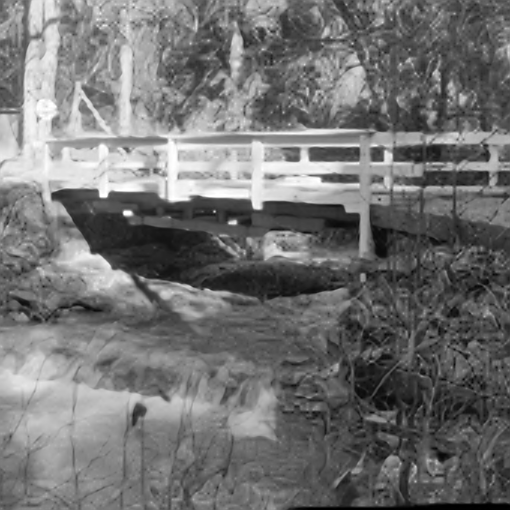
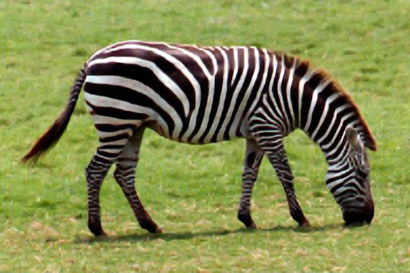
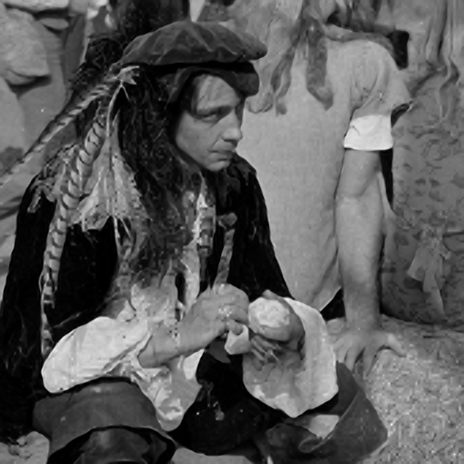

# Super-resolution

## 用法
環境:
1. pip install ttach
2. pip install git+https://github.com/ildoonet/pytorch-gradual-warmup-lr.git

使用方式:
(在super_resolution.ipynb中使用)
1. 在第2個block設定好根目錄(root = "../../../..")。
2. 在第5個block設定訓練超參數。
3. 在第6個block可以load進訓練好的VDSR模型並測試(模型檔名輸入在 trainedVDSR = LoadModel('model_name.pth') )。
4. 如果GPU memory夠大的話可以調整第2個block的clip參數，可以調整輸入模型的圖片大小。

## 結果
 
 
 
 
 
 
 
 
 
 
 
 
 
 
